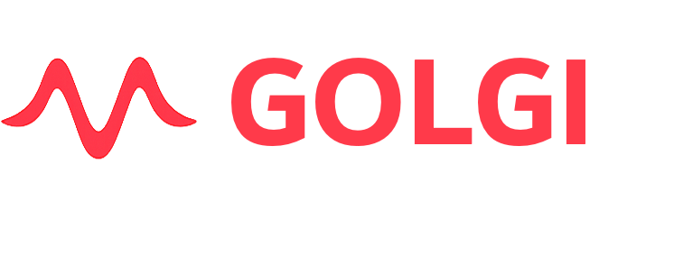

<p align="center">
  
</p>

<p align="center">
  <b>An open, graphical platform for image-to-recruitment modeling of peripheral nerve stimulation.</b>
</p>

<p align="center">
  
  
  
</p>

---

**golgi** takes a peripheral nerve from **image to stimulated fiber population through a single point-and-click interface** — no programming required — and mirrors every step in a scriptable Python API and command-line interface for batch and high-performance use. It builds anatomically realistic, multifascicular nerve models and computes fiber-type-selective recruitment end to end, on a **fully open finite-element stack with no commercial dependencies** (no COMSOL).

## Why golgi

- **No-code graphical interface.** The entire image-to-recruitment pipeline runs through a browser-based GUI — built for experimentalists and clinicians, not only computational modelers.
- **Fully open solver stack.** Anisotropic finite-element fields via FEniCSx/DOLFINx and meshing via TetGen/Gmsh — no proprietary solver required.
- **Genuine 3D and branching anatomy.** Reconstructs real three-dimensional nerves and traces curved, fascicle-following fiber trajectories through bifurcations, enabling **branch-selective** stimulation analysis that straight-fiber, cross-section-only tools cannot address.
- **Verifiable reproducibility.** Every study exports as an integrity-hashed, self-contained bundle whose image-to-recruitment provenance is checkable byte-for-byte with a single command.

## Pipeline

Image / surface / mask → promptable segmentation → multi-region tetrahedral meshing (endoneurium, perineurium, epineurium, electrode, cuff, surrounding bath) → anisotropic finite-element extracellular field with explicit perineurium contact impedance (reusable per-contact lead fields) → realistic fiber populations with straight or physically curved 3D trajectories → biophysical activation thresholds via interchangeable **NEURON (PyFibers)** and **AxonML GPU-surrogate** backends → recruitment, fascicular and branch selectivity, and current steering → publication-quality 3D renderings.

See [`FEATURES.md`](FEATURES.md) for the full feature surface.

## Three interfaces, one study

Every operation acts on a single shared `golgi.Study` state, so a graphical session, a script, and a batch job are fully interchangeable:

- **Graphical UI** (Trame, browser-based) — point-and-click; the primary interface.
- **Python API** (`golgi.Study`) — mirrors every GUI action for scripting and batch studies.
- **Command-line interface** — for cluster and continuous-integration use.

## Installation

golgi depends on FEniCSx/DOLFINx and NEURON, most easily installed with conda/mamba. The authoritative, frozen dependency list is in [`requirements-frozen.txt`](requirements-frozen.txt).

```bash
mamba create -n golgi -c conda-forge fenics-dolfinx python=3.12
mamba activate golgi
pip install -e .          # golgi + Python deps (Trame, PyVista, NEURON, PyFibers, …)
```

An optional NVIDIA GPU (CUDA) enables the AxonML high-throughput backend.

## Quick start

**Launch the graphical interface:**

```bash
python -m golgi.app
```

then open the printed local URL in your browser and work through the pipeline — segment, mesh, design the cuff, populate fibers, solve the field, and analyze recruitment — entirely by point-and-click.

**Or script the identical study through the API:**

```python
import golgi

s = golgi.Study.create("vagus_study")
s.import_geometry("vagus_microCT.tif")            # image, surface, or mask
s.segment(prompt="fascicle")                      # promptable segmentation
s.set_electrodes([dict(kind="ring-array", n_rows=4, n_cols=5)])
s.set_mesh(perineurium_ci=True)                   # multi-region + perineurium contact impedance
s.run_mesh()
s.set_fiber_population(preset="cervical_vagus_human")
s.set_fiber_seed(n_fibers=600, fiber_method="streamlines")
s.run_fem()                                       # anisotropic FEM + per-contact lead fields
s.run_sweep(backend="pyfibers")                   # activation thresholds / recruitment
s.export_bundle("vagus_study.golgi")              # integrity-hashed, replayable bundle
```

## Reproducible study bundles

Any study exports as a single `.golgi` bundle whose `manifest.json` records the pipeline directed acyclic graph with a SHA-256 hash of every input, output, and stage, plus the exact software version and a frozen dependency list. A recipient verifies it byte-for-byte (or is shown the first stage that differs):

```bash
golgi replay vagus_study.golgi
```

## Documentation

Full documentation and tutorials are in the [project wiki](https://github.com/CellularSyntax/golgi/wiki).

## License

golgi is free and open-source software, licensed under the **GNU Affero General Public License, version 3 or later (AGPL-3.0-or-later)** — see [LICENSE](LICENSE).

This license is required by golgi's dependency stack: golgi links **Gmsh** (GPLv2-or-later) and **TetGen** (AGPL-3.0, via the `tetgen` module, which compiles the TetGen core into its extension) as libraries, and it serves a **Trame** browser GUI, so the AGPL network-use clause (§13) applies. See [THIRD_PARTY_LICENSES.md](THIRD_PARTY_LICENSES.md) for the full dependency license inventory and compatibility notes.

No restriction is imposed beyond the AGPL terms. Note, however, that redistributing golgi inside a **closed-source or commercial** product additionally requires separate commercial licenses for TetGen (from WIAS) and Gmsh, since both are copyleft.

**Data** released alongside golgi — the micro-CT imaging datasets and the golgi study bundles (Zenodo) — is licensed separately under **CC-BY-4.0**.

## Citing golgi

If you use golgi, please cite the methods paper (PLOS Computational Biology, in review) and the companion software paper (SoftwareX, in review), and the archived software release on Zenodo (DOI assigned on release). Citation metadata is provided in `CITATION.cff` once the first release is tagged.
