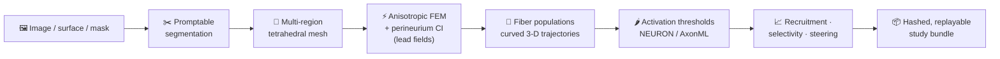

<p align="center">
  
</p>

<p align="center">
  <b>An open, graphical platform for image-to-recruitment modeling of peripheral nerve stimulation.</b>
</p>

<p align="center">
  <a href="https://doi.org/10.5281/zenodo.21281594"></a>
  <a href="LICENSE"></a>
  
  
  
  
  <a href="https://github.com/CellularSyntax/golgi/wiki"></a>
</p>

<p align="center">
  <a href="https://github.com/CellularSyntax/golgi/wiki">Documentation</a> ·
  <a href="https://github.com/CellularSyntax/golgi/wiki/Getting-Started">Getting started</a> ·
  <a href="https://github.com/CellularSyntax/golgi/wiki/GUI-Walkthrough">GUI walkthrough</a> ·
  <a href="https://github.com/CellularSyntax/golgi/wiki/Python-API">Python API</a> ·
  <a href="FEATURES.md">Feature roadmap</a>
</p>

---

**golgi** takes a peripheral nerve from **image to stimulated fiber population through a single
point-and-click interface** — no programming required — and mirrors every step in a scriptable Python
API and command-line interface for batch and high-performance use. It builds anatomically realistic,
multifascicular nerve models and computes fiber-type-selective recruitment end to end, on a **fully
open finite-element stack with no commercial dependencies** (no COMSOL).

## ✨ Highlights

- **🖱️ No-code graphical interface.** The entire image-to-recruitment pipeline runs in a browser-based
  GUI — built for experimentalists and clinicians, not only computational modelers.
- **🔓 Fully open solver stack.** Anisotropic finite-element fields via **FEniCSx/DOLFINx** and meshing
  via **TetGen/Gmsh** — no proprietary solver required.
- **🧬 Genuine 3-D and branching anatomy.** Reconstructs real three-dimensional nerves and traces
  curved, fascicle-following fiber trajectories *through bifurcations*, enabling **branch-selective**
  stimulation analysis that straight-fiber, cross-section-only tools cannot address.
- **🔬 Realistic biophysics.** Activation thresholds via interchangeable **NEURON (PyFibers)** and
  **AxonML GPU-surrogate** backends, with literature-backed fiber populations and tissue properties
  (Cole–Cole / IT'IS), and explicit **perineurium contact impedance**.
- **🎛️ Current steering & selectivity.** Arbitrary multi-contact (tri-/quadri-/N-polar) montages,
  recruitment curves, fascicular and branch selectivity, and side-by-side design comparison.
- **✅ Verifiable reproducibility.** Every study exports as an integrity-hashed, self-contained bundle
  whose image-to-recruitment provenance is checkable byte-for-byte with a single command.

## 🧠 The pipeline



Endoneurium, epineurium, electrode, cuff, and surrounding bath are meshed and solved with anisotropic
conductivities — with the perineurium represented as a contact-impedance interface — and reusable
per-contact lead fields. See
[`FEATURES.md`](FEATURES.md) for the full feature surface and the
[wiki](https://github.com/CellularSyntax/golgi/wiki/Pipeline-Overview) for the details of each stage.

## 🆚 How golgi compares

golgi's contribution is the combination most peripheral-nerve tools split apart: a **no-code GUI**,
**genuine 3-D branching anatomy**, **and** a **fully open** (no-COMSOL) solver stack — with
reproducible study bundles on top.

| | **golgi** | ASCENT | Sim4Life | DIY NEURON + FEM |
|---|:---:|:---:|:---:|:---:|
| No-code GUI | ✅ | ❌ (JSON/Python) | ✅ | ❌ |
| Fully open / no commercial solver | ✅ | ⚠️ FEM via COMSOL | ❌ commercial | ⚠️ varies |
| 3-D nerves + curved fibers through branches | ✅ | ⚠️ 2-D cross-section, straight fibers | ✅ | ⚠️ varies |
| Interchangeable NEURON + GPU fiber backends | ✅ | ✅ (NEURON) | ⚠️ | ⚠️ |
| One-command reproducible, hashed bundles | ✅ | ⚠️ | ⚠️ | ❌ |

<sub>Comparison reflects typical/default usage and is meant to position golgi, not to exhaustively
rank tools — each of the above is excellent within its design goals.</sub>

## 🖥️ Three interfaces, one study

Every operation acts on a single shared `golgi.Study` state, so a graphical session, a script, and a
batch job are fully interchangeable:

- **Graphical UI** (Trame, browser-based) — point-and-click; the primary interface.
- **Python API** (`golgi.Study`) — mirrors every GUI action for scripting and batch studies.
- **Command-line interface** (`golgi …`) — for cluster and continuous-integration use.

## 📦 Installation

golgi's compiled scientific core — **FEniCSx/DOLFINx** — is installed with conda/mamba; golgi and the
rest of its dependencies then install with pip:

```bash
mamba create -n golgi -c conda-forge fenics-dolfinx python=3.12
mamba activate golgi
pip install -e .              # golgi + its PyPI deps (GUI, meshing, visualization, analysis)
golgi fetch-tissue-db         # download the IT'IS tissue-properties database (see below)
```

Only the FEniCSx core is conda-provided (it is not portably pip-installable); the GUI, meshing,
visualization, and analysis stack (Trame, PyVista/VTK, Gmsh, bcrypt, …) is declared in
`pyproject.toml` and pulled in automatically. The **IT'IS tissue-properties database** (used for
Cole–Cole conductivity) is not redistributed with golgi — `golgi fetch-tissue-db` downloads it
directly from the [IT'IS Foundation](https://itis.swiss/virtual-population/tissue-properties/) (golgi
still runs without it, falling back to a Custom preset). **NEURON** — for biophysical activation thresholds
(`pip install -e ".[neuron]"` plus a NEURON install) — and the optional extras (an **NVIDIA GPU
(CUDA)** for the AxonML high-throughput backend, and a **MedSAM2/SAM** checkpoint for promptable
segmentation, with a stub-segmenter fallback) are documented on the
[**Installation**](https://github.com/CellularSyntax/golgi/wiki/Installation) wiki page. A pinned
version snapshot of a known-good environment is in [`requirements-frozen.txt`](requirements-frozen.txt).

## 🚀 Quick start

**Launch the graphical interface:**

```bash
golgi                 # then open the printed local URL in your browser
# (equivalently: python -m golgi.app --port 8080)
```

Work through the pipeline — import/segment, design the cuff, mesh, set materials, solve the field,
populate fibers, and analyze recruitment — entirely by point-and-click. See the
[GUI Walkthrough](https://github.com/CellularSyntax/golgi/wiki/GUI-Walkthrough).

**Or script the identical study through the API:**

```python
import golgi
from golgi.jobs.schemas import SweepRequest

s = golgi.Study.create("vagus_study")
s.import_nerve("nerve.stl")                       # STL / NAS / OBJ surface
s.set_mesh(use_epi=True, perineurium_ci=True)     # multi-region + perineurium contact impedance
s.set_electrodes([{                               # a 4×5 segmented ring array
    "name": "ring array",
    "electrode_type": "ring-array (NxM)",
    "array_n_rows": 4, "array_n_cols": 5,
}])
s.run_mesh()                                      # multi-region TetGen mesh
s.run_fem()                                       # anisotropic FEM + per-contact lead fields
s.set_fiber_seed(n_fibers=600, fiber_method="streamlines")
s.run_fibers()                                    # curved 3-D trajectories
result = s.run_sweep(SweepRequest(                # recruitment across amplitude
    mode="recruitment", amplitudes_mA=[0.1, 0.25, 0.5, 1.0, 2.0]))
s.export_bundle("vagus_study.golgi")              # integrity-hashed, replayable bundle
```

A complete, runnable version is in [`examples/recruitment_sweep.py`](examples/recruitment_sweep.py)
(it runs on a built-in synthetic nerve, no data required).

## 🔁 Reproducible study bundles

Any study exports as a single `.golgi` bundle whose `MANIFEST.json` records the pipeline directed
acyclic graph with a SHA-256 hash of every input, output, and stage, plus the exact software version
and a frozen dependency list. A recipient verifies it byte-for-byte (or is shown the first stage that
differs) with one command:

```bash
golgi replay vagus_study.golgi
```

See [Reproducible Study Bundles](https://github.com/CellularSyntax/golgi/wiki/Reproducible-Study-Bundles).

## 📚 Documentation

Full documentation, tutorials, and reference live in the
[**project wiki**](https://github.com/CellularSyntax/golgi/wiki):

| Get started | Use it | Under the hood |
|---|---|---|
| [Installation](https://github.com/CellularSyntax/golgi/wiki/Installation) | [GUI Walkthrough](https://github.com/CellularSyntax/golgi/wiki/GUI-Walkthrough) | [Pipeline Overview](https://github.com/CellularSyntax/golgi/wiki/Pipeline-Overview) |
| [Getting Started](https://github.com/CellularSyntax/golgi/wiki/Getting-Started) | [Electrodes & Cuff Designer](https://github.com/CellularSyntax/golgi/wiki/Electrodes-and-Cuff-Designer) | [Finite-Element Solver](https://github.com/CellularSyntax/golgi/wiki/Finite-Element-Solver) |
| [Python API](https://github.com/CellularSyntax/golgi/wiki/Python-API) | [Recruitment & Selectivity](https://github.com/CellularSyntax/golgi/wiki/Recruitment-Sweeps-and-Selectivity) | [Conductivity & Tissue](https://github.com/CellularSyntax/golgi/wiki/Conductivity-and-Tissue-Properties) |
| [Command-Line Interface](https://github.com/CellularSyntax/golgi/wiki/Command-Line-Interface) | [Reproducible Bundles](https://github.com/CellularSyntax/golgi/wiki/Reproducible-Study-Bundles) | [Fiber Models & Activation](https://github.com/CellularSyntax/golgi/wiki/Fiber-Models-and-Activation) |
| [Headless / HPC](https://github.com/CellularSyntax/golgi/wiki/Headless-and-HPC) | [Figures & Reports](https://github.com/CellularSyntax/golgi/wiki/Figures-and-Reports) | [Architecture](https://github.com/CellularSyntax/golgi/wiki/Architecture) |
| [Troubleshooting & FAQ](https://github.com/CellularSyntax/golgi/wiki/Troubleshooting-and-FAQ) | [Reproducing the Paper](https://github.com/CellularSyntax/golgi/wiki/Reproducing-the-Paper) | [Validation](https://github.com/CellularSyntax/golgi/wiki/Validation) |

## 🗂️ Repository layout

```text
golgi/
├── golgi/              # the package
│   ├── app.py          # Trame GUI (the primary interface)
│   ├── api.py          # headless golgi.Study API
│   ├── cli.py          # export / import / replay / compute-worker
│   ├── pipeline/       # mesh · fem · fibers · fiber_sim · sweep · selectivity · recording
│   ├── compute/        # FEniCSx solvers + TetGen/Gmsh runners
│   ├── conductivity/   # Cole–Cole · IT'IS DB · perineurium
│   ├── segmentation/   # promptable image segmentation + 3-D reconstruction
│   ├── scene/          # 3-D scene, cuff fitting, electrode patches
│   ├── figures/        # figure registry · export presets · PDF report
│   ├── projects/       # study bundles · replay · sweep cache
│   ├── jobs/           # in-process · subprocess · SLURM runners
│   ├── auth/           # users · sessions · audit log
│   └── ui/             # drawers · dialogs · components
├── cuff_designer.py    # ASCENT-style parametric cuff primitives
├── examples/           # runnable headless examples
├── paper_figs/         # scripts that regenerate the paper figures
└── tests/              # headless API + cable-equation tests
```

## ⚖️ License

golgi is free and open-source software under the **GNU Affero General Public License, version 3 or
later (AGPL-3.0-or-later)** — see [LICENSE](LICENSE).

This license is *required* by golgi's dependency stack: golgi links **Gmsh** (GPLv2-or-later) and
**TetGen** (AGPL-3.0, via the `tetgen` module) as libraries, and serves a **Trame** browser GUI, so
the AGPL network-use clause (§13) applies. See [THIRD_PARTY_LICENSES.md](THIRD_PARTY_LICENSES.md) for
the full dependency license inventory and compatibility notes (including the GPL-2.0-only PyFibers and
the proprietary, optional AxonML backend). Redistributing golgi inside a **closed-source or
commercial** product additionally requires separate commercial licenses for TetGen (WIAS) and Gmsh.

**Data** released alongside golgi — the micro-CT imaging datasets and the golgi study bundles
(Zenodo) — is licensed separately under **CC-BY-4.0**.

## 🙏 Built with

golgi stands on an all-open scientific stack:

| Role | Built on |
|---|---|
| Finite-element field solver | [FEniCSx/DOLFINx](https://fenicsproject.org/) · [PETSc/SLEPc](https://petsc.org/) (MUMPS sparse direct solve) |
| Meshing | [Gmsh](https://gmsh.info/) (surfaces) · [TetGen](https://wias-berlin.de/software/tetgen/) (tetrahedral volumes) · [meshio](https://github.com/nschloe/meshio) |
| Fiber biophysics & thresholds | [NEURON](https://www.neuron.yale.edu/) + [PyFibers](https://github.com/wmglab-duke/pyfibers) (MRG); AxonML (optional GPU surrogate) |
| Tissue properties | [IT'IS Foundation material database](https://itis.swiss/virtual-population/tissue-properties/) |
| 3-D visualization & rendering | [PyVista](https://pyvista.org/) · [VTK](https://vtk.org/) |
| Graphical interface | [Trame](https://kitware.github.io/trame/) + Vuetify (browser-based) |
| Geometry & segmentation | [scikit-image](https://scikit-image.org/) · [OpenCV](https://opencv.org/) · [SimpleITK](https://simpleitk.org/) · [trimesh](https://trimesh.org/) · [PyMeshFix](https://github.com/pyvista/pymeshfix) |
| Numerics & figures | [NumPy](https://numpy.org/) · [SciPy](https://scipy.org/) · [Matplotlib](https://matplotlib.org/) · [Plotly](https://plotly.com/python/) |
| Data & auth | [SQLAlchemy](https://www.sqlalchemy.org/) · [bcrypt](https://github.com/pyca/bcrypt) |

Inspired by and complementary to the open peripheral-nerve modeling community —
[ASCENT](https://github.com/wmglab-duke/ascent) and [NRV](https://github.com/nrv-framework/NRV).
