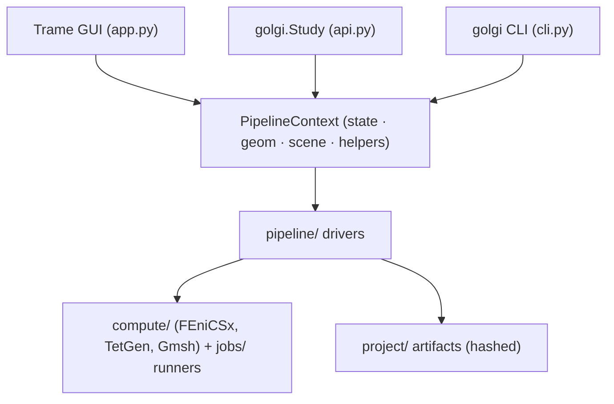

# Architecture

This page is for contributors and power users: how golgi is put together, and the design rules that
keep the GUI, API, and CLI in sync.

---

## One state, three interfaces

The central idea is that **every interface drives the same pipeline drivers over the same on-disk
project state**. The GUI is a [Trame](https://kitware.github.io/trame/) reactive front-end; the
headless [`golgi.Study`](Python-API) provides a state shim and a `NullScene` that satisfy the same
driver contracts with no renderer; the [CLI](Command-Line-Interface) dispatches bundle/worker
subcommands. As a result a project built in the browser opens in a script and vice-versa.

- **`PipelineContext`** (`pipeline/context.py`) bundles the reactive `state`, the mutable
  `GeometryState`, the `scene`, cancellation hooks, and a `helpers` bag. Both `build_app()` (GUI) and
  `Study._ensure_ctx()` (headless) construct one; the drivers don't care which.
- **`pipeline/`** holds the stage drivers (`mesh`, `fem`, `fibers`, `fiber_sim`, `pop_sim`, `sweep`,
  `selectivity`, `recording`). They are async and accept a cancel token.
- **`compute/`** holds the heavy numerics (FEniCSx solvers, TetGen/Gmsh runners) — invoked as
  subprocesses so the GUI stays responsive and so the GPL/AGPL mesher is process-isolated (see
  [License & Citation](License-and-Citation)).
- **`jobs/`** is the runner abstraction (in-process / subprocess / SLURM) — see [Headless / HPC](Headless-and-HPC).

## Package layout

| Package | Responsibility |
|---|---|
| `golgi/app.py` | the Trame GUI (the primary interface) |
| `golgi/api.py` | the headless `Study` API |
| `golgi/cli.py` | `export` / `import` / `replay` / `compute-worker` |
| `golgi/pipeline/` | stage drivers + `PipelineContext` |
| `golgi/compute/` | FEniCSx solvers, TetGen/Gmsh runners, trajectory solver |
| `golgi/conductivity/` | Cole–Cole, IT'IS DB, materials, perineurium |
| `golgi/segmentation/` | image I/O, promptable segmentation, 3-D reconstruction |
| `golgi/scene/` | 3-D scene graph, cuff fitting (PCA), electrode patches, `NullScene` |
| `golgi/figures/` | figure registry, export presets, PDF report, off-screen render |
| `golgi/projects/` | study bundles, replay, sweep cache, upload routes |
| `golgi/jobs/` | runner protocol + schemas + in-process/subprocess/SLURM |
| `golgi/auth/` | users, sessions, gating decorators, audit writer |
| `golgi/ui/` | drawers, dialogs, components, navbar, welcome |
| `golgi/state_defaults/` | factory defaults for every state group |
| `golgi/watchers/` | reactive GUI watchers |
| `golgi/actions/` | UI-event → pipeline-driver glue |
| `cuff_designer.py` | standalone ASCENT-style parametric cuff primitives |

## Design rules

These conventions keep features composable (and reproducibility honest):

- **Project-local artifacts.** Everything a stage produces lives under `<project>/` — never `~/.cache`
  or `/tmp`. Bundles and figure export depend on it.
- **Typed job schemas.** Every compute request is a `dataclass` in `jobs/schemas.py` with
  `serialize()` / `deserialize()` — no free-form dicts crossing the runner boundary.
- **Content hashes everywhere.** Every artifact carries a SHA-256 in a sibling manifest; this is what
  [replay](Reproducible-Study-Bundles) checks.
- **Cancellable drivers.** Every driver accepts a `CancelToken` and checks it between sub-units (per
  fiber, per config, per FEM band).
- **Register every figure.** New figures go in `figures/registry.py` in the same change, or bulk
  export silently misses them.
- **No project schema migrations.** New fields are optional; old projects open cleanly (e.g. the
  legacy electrode `"active"` role maps to `"anode"`).
- **Rank-0-only writes** under MPI.

## A note on `app.py`

The GUI module is large (it still inlines a lot of UI assembly). An ongoing refactor extracts domain
logic into `pipeline/`, `scene/`, `conductivity/`, `watchers/`, and `actions/`; the headless API
deliberately re-implements only the small closures it needs rather than importing the GUI. The living
plan and its status are in [`FEATURES.md`](https://github.com/CellularSyntax/golgi/blob/main/FEATURES.md).

---

### See also
[Pipeline Overview](Pipeline-Overview) · [Headless / HPC](Headless-and-HPC) ·
[Configuration Reference](Configuration-Reference) · [Contributing](Contributing)
