  

# golgi wiki

**golgi** is an open, graphical platform for **image-to-recruitment modeling of peripheral nerve
stimulation**. It takes a peripheral nerve from image to stimulated fiber population through a single
point-and-click interface — no programming required — and mirrors every step in a scriptable Python
API and command-line interface. It builds anatomically realistic, multifascicular 3-D nerve models
and computes fiber-type-selective recruitment end to end on a **fully open finite-element stack with
no commercial dependencies** (no COMSOL).

This wiki is the full documentation. New here? Start with **[Installation](Installation)** →
**[Getting Started](Getting-Started)** → **[GUI Walkthrough](GUI-Walkthrough)**.

---

## The pipeline at a glance

```mermaid
flowchart LR
    A["Image / surface / mask"] --> B["Promptable segmentation"]
    B --> C["Multi-region tetrahedral mesh"]
    C --> D["Anisotropic FEM + perineurium CI"]
    D --> E["Fiber populations + curved 3-D trajectories"]
    E --> F["Activation thresholds (NEURON / AxonML)"]
    F --> G["Recruitment, selectivity, current steering"]
    G --> H["Hashed, replayable study bundle"]
```

Each box is a documented stage — see **[Pipeline Overview](Pipeline-Overview)**.

## What makes golgi different

- **No-code GUI** for the whole pipeline (Trame, browser-based) — see [GUI Walkthrough](GUI-Walkthrough).
- **Fully open solver stack** — FEniCSx/DOLFINx + TetGen/Gmsh, no COMSOL — see
  [Finite-Element Solver](Finite-Element-Solver).
- **Genuine 3-D, branching anatomy** with curved, fascicle-following fibers through bifurcations —
  see [Fiber Populations & Trajectories](Fiber-Populations-and-Trajectories).
- **Realistic biophysics** — NEURON/PyFibers and AxonML backends, Cole–Cole / IT'IS tissue
  properties, explicit perineurium contact impedance — see
  [Fiber Models & Activation](Fiber-Models-and-Activation) and
  [Conductivity & Tissue Properties](Conductivity-and-Tissue-Properties).
- **Current steering & selectivity** — arbitrary N-polar montages, recruitment curves, fascicular /
  branch selectivity, design comparison — see [Recruitment Sweeps & Selectivity](Recruitment-Sweeps-and-Selectivity).
- **Reproducibility built in** — integrity-hashed, replayable [study bundles](Reproducible-Study-Bundles).

## Three interfaces, one study

Every operation acts on a single shared `golgi.Study` state, so a graphical session, a script, and a
batch job are interchangeable.

| Interface | Use it for | Page |
|---|---|---|
| **Graphical UI** | exploration, design, teaching — the primary interface | [GUI Walkthrough](GUI-Walkthrough) |
| **Python API** (`golgi.Study`) | notebooks, batch studies, CI | [Python API](Python-API) |
| **Command line** (`golgi …`) | clusters, automation, bundle verification | [Command-Line Interface](Command-Line-Interface) |

## Find your way

- **I want to run my first model** → [Getting Started](Getting-Started)
- **I want to understand the GUI** → [GUI Walkthrough](GUI-Walkthrough)
- **I want to script it** → [Python API](Python-API) · [Headless / HPC](Headless-and-HPC)
- **I want the science** → [Pipeline Overview](Pipeline-Overview) ·
  [Finite-Element Solver](Finite-Element-Solver) · [Fiber Models & Activation](Fiber-Models-and-Activation)
- **I want to design an electrode** → [Electrodes & Cuff Designer](Electrodes-and-Cuff-Designer)
- **I want to reproduce / share results** → [Reproducible Study Bundles](Reproducible-Study-Bundles) ·
  [Reproducing the Paper](Reproducing-the-Paper)
- **Something broke** → [Troubleshooting & FAQ](Troubleshooting-and-FAQ)
- **What's a term mean?** → [Glossary](Glossary)

## Project facts

- **License:** AGPL-3.0-or-later (data: CC-BY-4.0) — see [License & Citation](License-and-Citation).
- **Platforms:** Linux, macOS.
- **Status:** companion to the methods paper (PLOS Computational Biology, in review) and software
  paper (SoftwareX, in review).
- **Roadmap:** the living feature plan is [`FEATURES.md`](https://github.com/CellularSyntax/golgi/blob/main/FEATURES.md).
