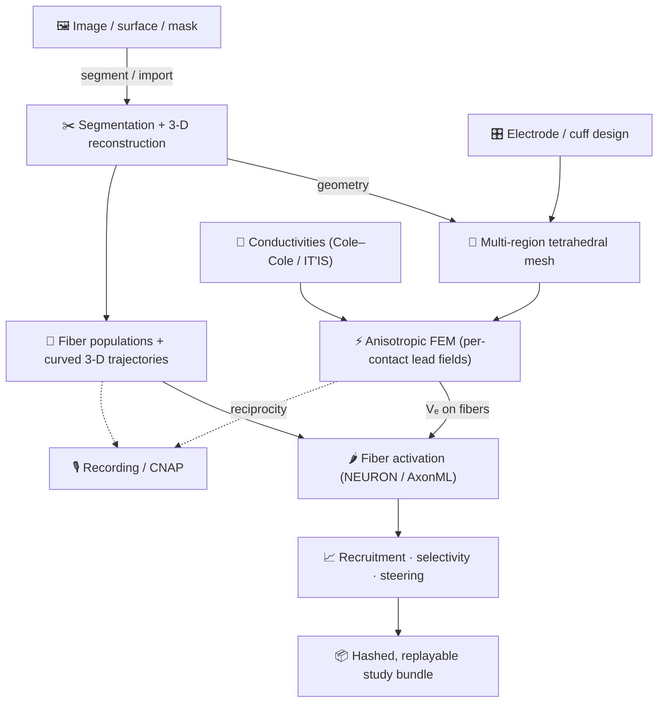

# Pipeline Overview

golgi models peripheral nerve stimulation as a directed sequence of stages, from a raw image to a
fiber-type-selective recruitment result. The same stages run whether you drive them from the
[GUI](GUI-Walkthrough), the [Python API](Python-API), or the [CLI](Command-Line-Interface) — they all
act on one shared `golgi.Study` state on disk.

---

## The stages

| # | Stage | Input → Output | API | Page |
|---|---|---|---|---|
| 1 | **Geometry** | image/mask/surface → 3-D nerve geometry (endo/epi, fascicles) | `import_nerve` (+ GUI segmentation) | [Geometry Import & Segmentation](Geometry-Import-and-Segmentation) |
| 2 | **Electrode design** | electrode type + placement → cuff geometry, contacts, polarities | `set_electrodes` / Cuff Designer | [Electrodes & Cuff Designer](Electrodes-and-Cuff-Designer) |
| 3 | **Meshing** | geometry + cuff → multi-region tetrahedral mesh | `set_mesh` + `run_mesh` | [Meshing](Meshing) |
| 4 | **Materials** | tissue conductivities (anisotropic, frequency-aware) | `set_mesh(...)` / Materials drawer | [Conductivity & Tissue Properties](Conductivity-and-Tissue-Properties) |
| 5 | **FEM** | mesh + σ + electrodes → extracellular field Vₑ, lead fields, impedance | `run_fem` | [Finite-Element Solver](Finite-Element-Solver) |
| 6 | **Fibers** | geometry → curved 3-D fiber trajectories, branch-classified | `set_fiber_seed` + `run_fibers` | [Fiber Populations & Trajectories](Fiber-Populations-and-Trajectories) |
| 7 | **Activation** | Vₑ on fibers + pulse → spikes, thresholds | (within `run_sweep` / GUI panels) | [Fiber Models & Activation](Fiber-Models-and-Activation) |
| 8 | **Analysis** | thresholds → recruitment curves, selectivity, comparison | `run_sweep` | [Recruitment Sweeps & Selectivity](Recruitment-Sweeps-and-Selectivity) |
| — | **Recording** | fiber currents + reciprocity lead fields → CNAP | `pipeline/recording` | [Recording & CNAP](Recording-and-CNAP) |
| 9 | **Export** | the whole study → bundle / figures / PDF report | `export_bundle` | [Reproducible Bundles](Reproducible-Study-Bundles) · [Figures & Reports](Figures-and-Reports) |

---

## Why the stages are ordered this way

- **Geometry before meshing** — the mesh is built from the reconstructed surfaces (endoneurium,
  epineurium) plus the cuff and contacts.
- **Electrodes feed both meshing and FEM** — contacts become tagged facets in the mesh and current
  boundary conditions in the solve.
- **Fibers are independent of the cuff** — trajectories are generated on a nerve-only mesh (decoupled
  from cuff position), so the same fibers can be evaluated against different electrode designs.
- **FEM produces lead fields, not just one field** — because the quasi-static problem is **linear in
  current**, golgi solves a per-contact basis once and combines it for any montage and any amplitude.
  This is what makes multi-contact [current steering](Recruitment-Sweeps-and-Selectivity) and fast
  amplitude sweeps possible without re-solving.
- **Activation reads Vₑ sampled on the fibers** — `run_fem` writes `paths_Ve.npz` (the field along
  every fiber), which the [fiber models](Fiber-Models-and-Activation) turn into spikes and thresholds.

## Caching & reuse

Every stage writes its artifacts under the project directory and is **content-hashed**, so unchanged
inputs are not recomputed:

- FEM lead fields are fingerprinted on (mesh, σ, contact geometry, solver preset).
- Sweeps are cached by a SHA over the request — re-running an identical sweep is instant.
- An `I_stim` amplitude sweep **rescales the cached field** instead of re-solving the FEM (linearity).

This same hashing underpins the [reproducible study bundle](Reproducible-Study-Bundles): the bundle's
manifest records the stage DAG and the hash of every input and output, so `golgi replay` can verify
the whole chain byte-for-byte.

## Multiple designs, one nerve

A project can hold several **designs** (electrode geometries) and **configs** (polarity/current
montages) on the same nerve. The nerve and far-field bath are canonical and shared; only the cuff
moves between designs. This is what powers cuff-position sweeps and side-by-side
[design comparison](Recruitment-Sweeps-and-Selectivity).

---

### See also
[Architecture](Architecture) · [Configuration Reference](Configuration-Reference) ·
[Getting Started](Getting-Started)
